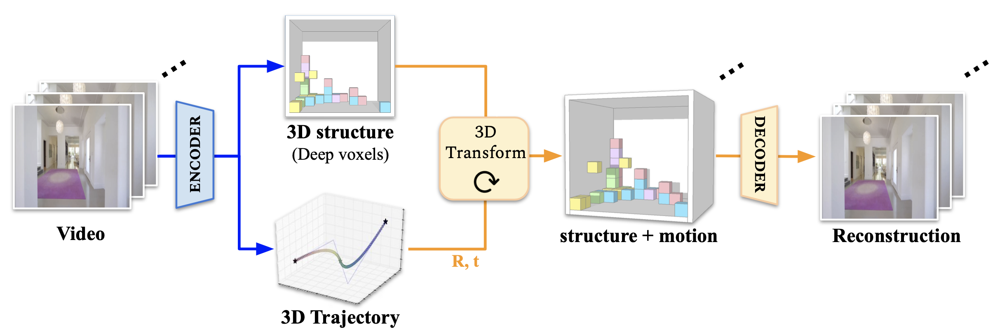

# Video Autoencoder: self-supervised disentanglement of 3D structure and motion


This repository contains the code (in PyTorch) for the model introduced in the following paper:

Video Autoencoder: self-supervised disentanglement of 3D structure and motion\
[Zihang Lai](https://zlai0.github.io/), [Sifei Liu](https://www.sifeiliu.net/), [Alexi A. Efros](https://people.eecs.berkeley.edu/~efros/), [Xiaolong Wang](https://xiaolonw.github.io/) \
ICCV, 2021\
**[[Paper]](https://arxiv.org/abs/2110.02951) [[Project Page]](https://zlai0.github.io/VideoAutoencoder) [[12-min oral pres. video]](https://youtu.be/SIg_8URon14) [[3-min supplemental video]](https://youtu.be/UaJZd4FrM8E)**


### Citation
```
@inproceedings{Lai21a,
        title={Video Autoencoder: self-supervised disentanglement of 3D structure and motion},
        author={Lai, Zihang and Liu, Sifei and Efros, Alexei A and Wang, Xiaolong},
        booktitle={ICCV},
        year={2021}
}
```

## Contents

1. [Introduction](#introduction)
2. [Data preparation](#data-preparation)
3. [Training](#training)
4. [Evaluation](#evaluation)
5. [Pretrained model](#pre-trained-models)

## Introduction

We present Video Autoencoder for learning disentangled representations of 3D structure and camera pose from videos in a self-supervised manner. Relying on temporal continuity in videos, our work assumes that the 3D scene structure in nearby video frames remains static. Given a sequence of video frames as input, the Video Autoencoder extracts a disentangled representation of the scene including: (i) a temporally-consistent deep voxel feature to represent the 3D structure and (ii) a 3D trajectory of camera poses for each frame. These two representations will then be re-entangled for rendering the input video frames. Video Autoencoder can be trained directly using a pixel reconstruction loss, without any ground truth 3D or camera pose annotations. The disentangled representation can be applied to a range of tasks, including novel view synthesis, camera pose estimation, and video generation by motion following. We evaluate our method on several large-scale natural video datasets, and show generalization results on out-of-domain images.


## Dependencies
The following dependencies are not strict - they are the versions that we use.
- [Python (3.8.5)](https://www.python.org/downloads/)
- [PyTorch (1.7.1)](http://pytorch.org)
- CUDA 11.0
- Python packages, install with ``pip install -r requirements.txt``

## Data preparation
### RealEstate10K:
1. Download the dataset from [RealEstate10K](https://google.github.io/realestate10k/).
2. Download videos from RealEstate10K dataset, decode videos into frames. You might find the [RealEstate10K_Downloader](https://github.com/cashiwamochi/RealEstate10K_Downloader) written by cashiwamochi helpful. Organize the data files into the following structure:
```
RealEstate10K/
    train/
        0000cc6d8b108390.txt
        00028da87cc5a4c4.txt
        ...
    test/
        000c3ab189999a83.txt
        000db54a47bd43fe.txt
        ...
dataset/
    train/
        0000cc6d8b108390/
            52553000.jpg
            52586000.jpg
            ...
        00028da87cc5a4c4/
            ...
    test/
        000c3ab189999a83/
        ...
```
3. Subsample the training set at one-third of the original frame-rate (so that the motion is sufficiently large). You can use ``scripts/subsample_dataset.py``.
4. A list of videos ids that we used (10K for training and 5K for testing) is provided here:
    1. [Training video ids](./data/video_ids_train.txt) and [testing video ids](./data/video_ids_test.txt).
    2. Note: as time changes, the availability of videos could change.

### Matterport 3D (this could be tricky):
1. Install [habitat-api](https://github.com/facebookresearch/habitat-api) and [habitat-sim](https://github.com/facebookresearch/habitat-sim). You need to use the following repo version (see this [SynSin issue](https://github.com/facebookresearch/synsin/issues/2) for details):
    1. habitat-sim: d383c2011bf1baab2ce7b3cd40aea573ad2ddf71
    2. habitat-api: e94e6f3953fcfba4c29ee30f65baa52d6cea716e

2. Download the models from the [Matterport3D dataset](https://niessner.github.io/Matterport/) and the [point nav datasets](https://github.com/facebookresearch/habitat-api#task-datasets). You should have a dataset folder with the following data structure:
   ```
   root_folder/
        mp3d/
            17DRP5sb8fy/
                17DRP5sb8fy.glb  
                17DRP5sb8fy.house  
                17DRP5sb8fy.navmesh  
                17DRP5sb8fy_semantic.ply
            1LXtFkjw3qL/
                ...
            1pXnuDYAj8r/
                ...
            ...
        pointnav/
            mp3d/
                ...
    ```
3. **Walk-through videos for pretraining**: We use a ``ShortestPathFollower`` function provided by the Habitat navigation package to generate episodes of tours of the rooms. See ``scripts/generate_matterport3d_videos.py`` for details.
4. **Training and testing view synthesis pairs**: we generally follow the same steps as the [SynSin data instruction](https://github.com/facebookresearch/synsin/blob/main/MP3D.md). The main difference is that we precompute all the image pairs.  See ``scripts/generate_matterport3d_train_image_pairs.py`` and ``scripts/generate_matterport3d_test_image_pairs.py`` for details.

### Replica:
1. **Testing view synthesis pairs**: This procedure is similar to step 4 in Matterport3D - with only the specific dataset changed. See ``scripts/generate_replica_test_image_pairs.py`` for details.

### Configurations
Finally, change the data paths in ``configs/dataset.yaml`` to your data location.

## Pre-trained models
- Pre-trained model (RealEstate10K): [Link](https://drive.google.com/file/d/1ddM1BF_Itg0pyvgE9uKP1aeS9XEBzN66/view?usp=sharing)
- Pre-trained model (Matterport3D): [Link](https://drive.google.com/file/d/1uuLUPq5H_jxs_nspycEkQWRpnSXXdxIx/view?usp=sharing)

## Training:
Use this script:

``CUDA_VISIBLE_DEVICES=0,1 python train.py --savepath log/train --dataset RealEstate10K``

Some optional commands (w/ default value in square bracket):
- Select dataset: ``--dataset [RealEstate10K]``
- Interval between clip frames: ``--interval [1]``
- Change clip length: ``--clip_length [6]``
- Increase/decrease lr step: ``--lr_adj [1.0]``
- For Matterport3D finetuning, you need to set ``--clip_length 2``, because the data are pairs of images.


## Evaluation:
### 1. Generate test results:
Use this script (for testing RealEstate10K):

``CUDA_VISIBLE_DEVICES=0  python test_re10k.py --savepath log/model --resume log/model/checkpoint.tar --dataset RealEstate10K``

or this script (for testing Matterport3D/Replica):

``CUDA_VISIBLE_DEVICES=0  python test_mp3d.py --savepath log/model --resume log/model/checkpoint.tar --dataset Matterport3D``

Some optional commands:

- Select dataset: ``--dataset [RealEstate10K]``
- Max number of frames: ``--frame_limit [30]``
- Max number of sequences: ``--video_limit [100]``
- Use training set to evaluate: ``--train_set``


Running this will generate a output folder where the results (videos and poses) save. If you want to   visualize the pose, use packages for evaluation of odometry, such as [evo](https://github.com/MichaelGrupp/evo). If you want to quantitatively evaluate the results, see 2.1, 2.2.

### 2.1 Quantitative Evaluation of synthesis results:
Use this script:

``python eval_syn_re10k.py [OUTPUT_DIR]`` (for RealEstate10K)\
``python eval_syn_mp3d.py [OUTPUT_DIR]`` (for Matterport3D)

Optional commands:
- Evaluate LPIPS: ``--lpips``

### 2.2 Quantitative Evaluation of pose prediction results:
Use this script:

``python eval_pose.py [POSE_DIR]``

## Contact
For any questions about the code or the paper, you can contact zihang.lai at gmail.com.
